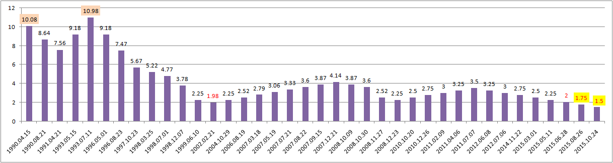
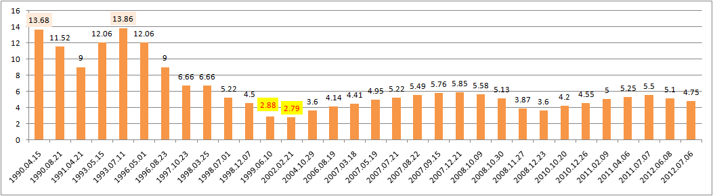
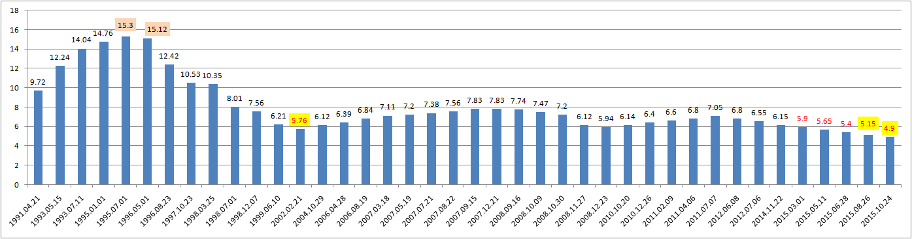
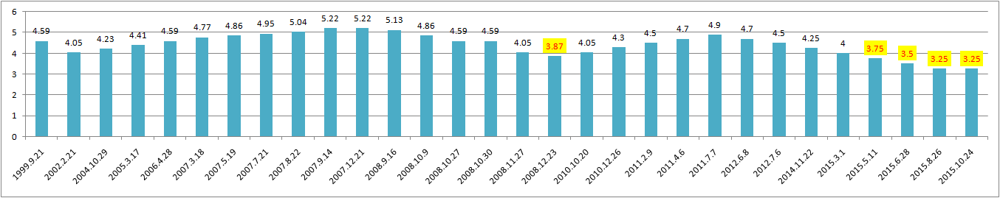

## 银行历年存款贷款利率图（1991-2015）

[中国人民银行-人民币现行利率水平](http://www.pbc.gov.cn/zhengcehuobisi/125207/125213/125440/125838/125885/index.html)

> 银行存款利率（1990-2015）{1年期}

> 银行存款利率（1990-2015）{5年期}

> 银行贷款利率（1991-2015）{5年以上}

> 公积金贷款利率（1999-2015）{5年以上}

